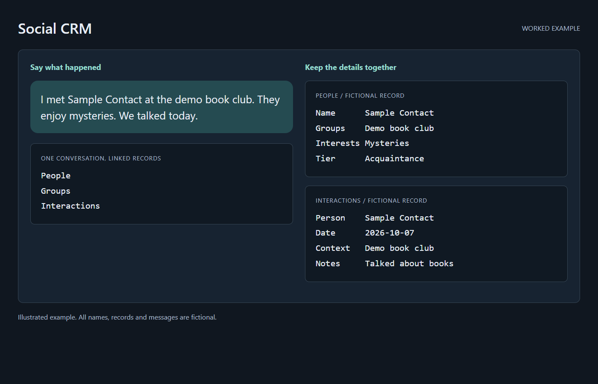

# social-crm-template

A personal social CRM that lives in Airtable and is operated entirely by an AI agent (built for Claude; portable to any agent that can call the Airtable API). You talk to your agent in plain language — *"met a guy named Sam at the climbing gym, seemed cool"*, *"glob this list"*, *"who am I letting go cold?"* — and the agent maintains the database: contacts, groups, events, an interaction log, name lists, and an audit trail.

This is an anonymized template extracted from a real, daily-driven system. All IDs, tokens, and values are placeholders or invented; you supply your own base and your own people.

## Quickstart: point your agent at this repo

1. Connect your agent to Airtable (the Airtable MCP server, or a personal access token with schema + data read/write scopes).
2. Give your agent this repo (clone it, or paste the raw file URLs) and say: **"Follow SETUP.md and build this CRM."**
3. The agent creates the base, all six tables, and the links from [schema.json](schema.json), verifies the result against the spec, personalizes the choice lists with you, and installs [SKILL.md](SKILL.md) as its standing operating manual.

After that, the skill is the product: every future conversation that mentions your contacts routes through it.

## What's in the repo

| File | What it is | Who reads it |
|---|---|---|
| [SETUP.md](SETUP.md) | The build runbook: step-by-step instructions for an agent to create the base from scratch, verify it, and wire up the skill | Your agent, once |
| [schema.json](schema.json) | Machine-readable spec of the full base: 6 tables, every field, type, choice list, and link — the single source of truth for setup | Your agent, during setup |
| [SKILL.md](SKILL.md) | The operating manual the agent runs on every day afterward: API call patterns and gotchas, the language triggers, the standing workflows, data-quality rules | Your agent, every session |
| [roster-globs.md](roster-globs.md) | Design doc for the Rosters pattern — why name dumps are stored as single list records instead of contacts | You, if curious |
| [scheduled-tasks/](scheduled-tasks/) | Three recurring-job specs that run against this schema unattended (see Scheduled automations below) | Your agent, on a schedule |

## The data model

Six tables:

- **People** — one record per person: contact info, relationship tier, per-person follow-up cadence, romantic-interest stage, likes, family, how you met, last contacted.
- **Groups** — clubs, communities, friend groups, workplaces; linked from People.
- **Events** — parties, trips, gatherings; links the People who were there and can anchor a Roster.
- **Interactions** — dated log of real-world contact (met up, called, texted), linked to People. This is what powers the "going cold" math.
- **Rosters** — raw name lists from events kept as *text*, not contacts. Most names on a list never deserve a record; the roster preserves them so recurrence is detectable months later.
- **Changelog** — audit trail of what the agent changed and why, so you can review its work.

Two opinionated design choices worth knowing before you adopt it:

- **Capture is asymmetric with retrieval.** Adding data must be effortless (one sentence to your agent, often from a phone on the way home) or it won't happen. The schema is therefore optimized for the agent to file things into structured fields for you — the standing rule is that the Notes field is a last resort.
- **Not every name becomes a contact.** The Rosters table exists so an 80-name sign-up list costs one record, not 80. Names are promoted to People only when they keep showing up and you say so.

## What you actually use it for

- **Capture on the go** — "Met Priya at Jordan's birthday thing, she's in the Sunday soccer group, works in urban planning. Add her." The agent creates the record, links the group, cross-references past rosters for her name, and logs the addition.
- **Log interactions** — "Had lunch with Marcus." One Interaction record, Last Contacted updated. Anything forward-looking they mentioned goes into its own Follow-up Hooks field, one topic per line.
- **Recall before you meet** — "Seeing Marcus tonight." The agent pulls your last few interactions with that person and leads with the open follow-up hooks, so you walk in knowing what to ask about. The weekly nudge attaches the same hooks to each person it tells you to reach out to.
- **The bump scan** — "Who am I letting go cold?" Every person carries their own follow-up cadence (weekly for the friendship you're building, twice a year for the college friend). The agent computes who's overdue and hands you a ranked list with phone numbers.
- **Glob a roster** — Paste the event sign-up list or the names you half-remember from a party. One record, zero contact spam.
- **Recurrence detection** — "Anyone keep showing up?" The agent scans all rosters for names that appear again and again and proposes promoting them to real contacts, with the history attached ("on 4 lists since January").
- **Intentional friendship-building** — the `Building` tier + a cadence marks someone you've decided to invest in, and keeps them surfacing until they've graduated to Friend.
- **Romantic-lane tracking** — a separate stage field (Interested → Flirting → Mutual → …) so that lane is queryable without polluting the friendship tiers.
- **Remember the human details** — birthdays, partners' and kids' names, food preferences, how you met. Ask "what do I know about Sam?" before you see them again.
- **Data quality on autopilot** — the skill carries standing rules (clubs are linked records, never text; never overwrite a filled field; flag instead of guess), and a periodic scan can tidy drift.
- **Scheduled automations** (optional) — production-tested specs ship in [scheduled-tasks/](scheduled-tasks/): [weekly-social-engagement-nudge](scheduled-tasks/weekly-social-engagement-nudge/SKILL.md) (the "who's due" bump scan + open-Saturday social check), [monthly-crm-data-quality-scan](scheduled-tasks/monthly-crm-data-quality-scan/SKILL.md) (misfiled fields, stale records, old-interaction consolidation), and [weekly-changelog-consolidation](scheduled-tasks/weekly-changelog-consolidation/SKILL.md) (free-tier space management). The skill documents how to keep them from breaking when the schema evolves, and how to pick their execution environment: because the CRM's critical path is pure connector-MCP, these run on cloud/hosted schedulers with no desktop machine awake — only browser fallbacks and local-MCP notification channels require a local session.

All example names above are invented.

## Requirements

- An Airtable account (free tier works; the Rosters design exists partly to respect free-tier record limits).
- An agent with Airtable access: Claude with the Airtable MCP server is the tested path; anything that can call the Airtable REST API can run the same playbook via the endpoints in SETUP.md.
- Optional: a Telegram bot for push summaries of batch operations.

## Privacy notes

This system stores real information about real people in your life on a third-party service, operated by an AI agent. Three ground rules from the source system:

- **Never commit your filled-in copy of SKILL.md** — once the placeholders are real IDs (and possibly a token), it's a credential-bearing private file.
- Keep the base private; the agent needs API access, not the world.
- The Changelog table exists so you can audit what the agent did — read it occasionally.

## License

MIT. See [LICENSE](LICENSE).
